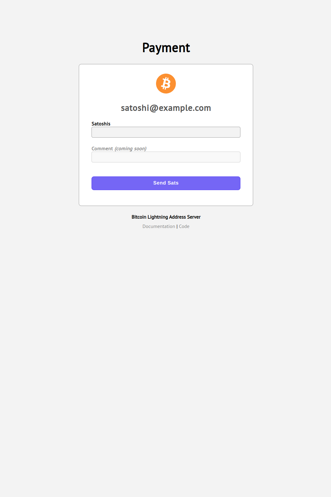
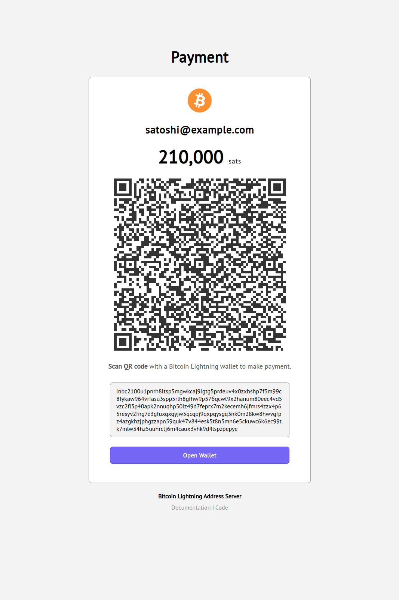

# Satdress

Lightning Address Server

## How to run

1. Download the binary from the releases page (or compile with `go build` or `go get`)
2. Create a config file using the example file `config-sample.yml`.
3. Start the app with `./satdress`

